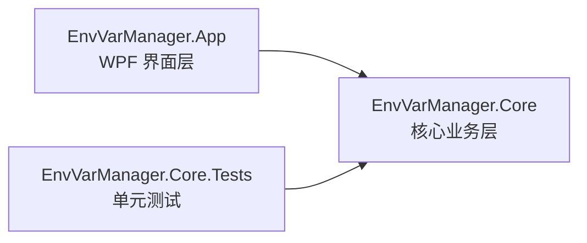
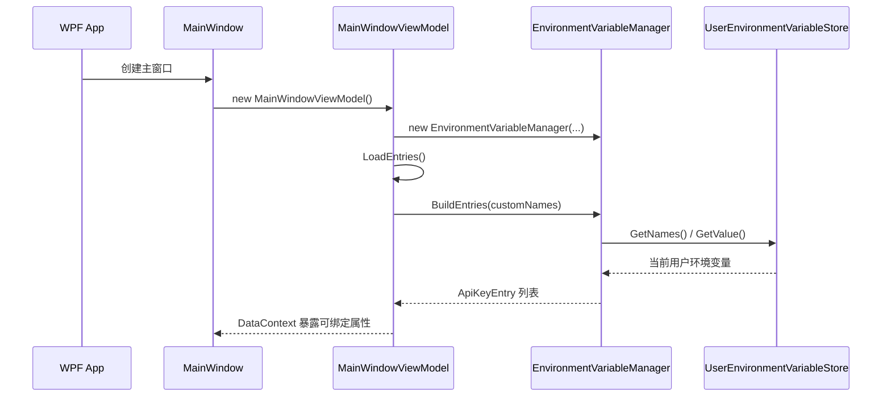
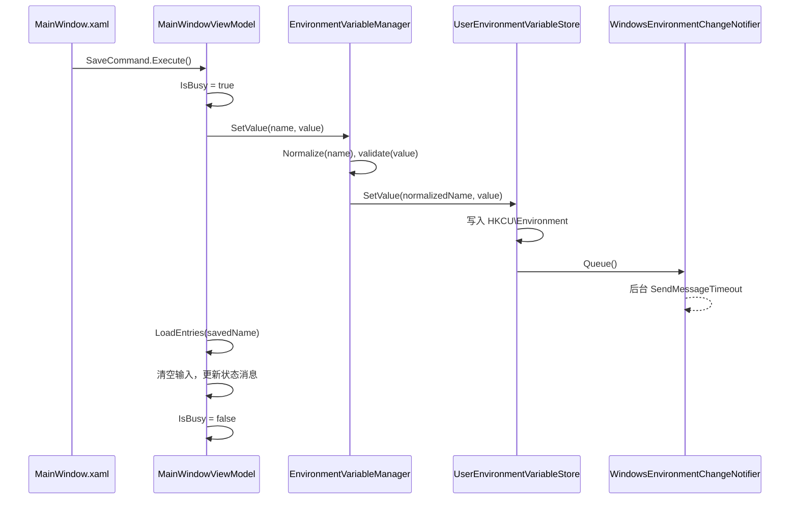

# 环境变量管理器项目设计文档

这份文档面向熟悉 Java、但不熟悉 C# 和 WPF 的开发者。读完后，你应该能回答三个问题：

1. 这个项目分了哪些层，每层负责什么。
2. WPF 界面如何通过 ViewModel 调用核心业务。
3. 保存、更新、删除 Windows 用户级环境变量时，代码到底做了什么。

## 一句话理解

这个项目是一个 Windows WPF 桌面客户端，用来查看、添加、更新和删除“当前用户”的环境变量，尤其是各种 API key。

如果用 Java 后端项目类比：

- `EnvVarManager.sln` 类似一个 Maven multi-module 工程的总入口。
- `src/EnvVarManager.Core` 类似业务模块，不依赖 UI。
- `src/EnvVarManager.App` 类似表现层模块，只负责 WPF 窗口、绑定和用户交互。
- `tests/EnvVarManager.Core.Tests` 类似业务模块单元测试。
- `IEnvironmentVariableStore` 类似 Repository 接口。
- `UserEnvironmentVariableStore` 类似 Windows Registry 版 Repository 实现。
- `MainWindowViewModel` 类似一个面向 UI 的 Application Service / Controller，只是它不直接操作控件，而是暴露可绑定属性和命令。

## 总体架构

项目采用一个轻量的 MVVM 架构。

MVVM 是 WPF 里最常见的组织方式：

- `View`：XAML 写的界面，相当于 HTML / Swing 布局。
- `ViewModel`：界面状态和用户动作，相当于 Controller + DTO + 一部分页面状态管理。
- `Model / Core`：核心业务对象和操作逻辑。

当前项目的依赖方向是单向的：



核心层不引用 WPF。这个设计很重要，因为环境变量管理、变量名校验、脱敏规则都可以脱离界面测试。

## 目录结构

```text
EnvVarManager.sln
src/
  EnvVarManager.Core/
    ApiKeyEntry.cs
    EnvironmentVariableManager.cs
    EnvironmentVariableNameValidator.cs
    IEnvironmentVariableStore.cs
    KnownApiKeyCatalog.cs
    KnownApiKeyDefinition.cs
    SecretMasker.cs
    UserEnvironmentVariableStore.cs
    WindowsEnvironmentChangeNotifier.cs
  EnvVarManager.App/
    App.xaml
    MainWindow.xaml
    MainWindow.xaml.cs
    Commands/
      RelayCommand.cs
    Services/
      CustomVariableRegistry.cs
      SafeClipboard.cs
    ViewModels/
      MainWindowViewModel.cs
      ApiKeyRowViewModel.cs
tests/
  EnvVarManager.Core.Tests/
    EnvironmentVariableManagerTests.cs
```

## C# 基础概念对照

项目里用到的 C# 特性不复杂，但和 Java 写法不太一样。

### namespace

```csharp
namespace EnvVarManager.Core;
```

这类似 Java 的：

```java
package envvarmanager.core;
```

C# 文件不强制目录和 namespace 完全一致，但实际项目里通常会保持一致。

### record

```csharp
public sealed record ApiKeyEntry(
    string Name,
    string DisplayName,
    string Description,
    string Category,
    bool IsKnown,
    bool IsSet,
    string MaskedValue,
    int ValueLength);
```

这很接近 Java 的 `record`：

```java
public record ApiKeyEntry(
    String name,
    String displayName,
    String description,
    String category,
    boolean known,
    boolean set,
    String maskedValue,
    int valueLength
) {}
```

C# 的属性名通常用 PascalCase，比如 `Name`、`DisplayName`。

### nullable

项目启用了：

```xml
<Nullable>enable</Nullable>
```

所以 `string` 表示理论上不应为 `null`，`string?` 表示可能为 `null`。这类似 Java 里团队约定使用 `@Nullable` / `@NotNull`，但 C# 编译器会帮你做静态检查。

### collection expression

项目里有一些 `[]`：

```csharp
private readonly ObservableCollection<ApiKeyRowViewModel> _entries = [];
```

这是新版本 C# 的集合表达式，意思接近：

```csharp
new ObservableCollection<ApiKeyRowViewModel>()
```

## Core 层设计

Core 层是这个项目最像 Java 后端代码的部分。它不关心窗口怎么画，也不关心按钮怎么点。

### ApiKeyEntry：列表项的领域快照

`ApiKeyEntry` 表示一个环境变量在当前时刻的展示状态。

它不是数据库实体，也不是可变对象，而是一个只读快照：

- `Name`：环境变量名，例如 `OPENAI_API_KEY`。
- `DisplayName`：界面展示名，例如 `OpenAI`。
- `Description`：说明。
- `Category`：分类。
- `IsKnown`：是否是内置常见变量。
- `IsSet`：当前用户环境变量里是否已经设置。
- `MaskedValue`：脱敏后的值。
- `ValueLength`：原始值长度。

它被设计成 `record`，说明它更像 Java DTO / value object。

### KnownApiKeyDefinition 和 KnownApiKeyCatalog

`KnownApiKeyDefinition` 表示一个内置变量定义。

`KnownApiKeyCatalog.DefaultDefinitions` 是内置列表，包含 OpenAI、Claude、DashScope、DeepSeek、GitHub Token 等常见变量。

这部分可以类比 Java 里的：

```java
public final class KnownApiKeyCatalog {
    public static final List<KnownApiKeyDefinition> DEFAULT_DEFINITIONS = List.of(...);
}
```

它的作用不是读取真实环境变量，而是告诉界面“应该优先展示哪些常见变量”。

### EnvironmentVariableNameValidator：变量名规则

`EnvironmentVariableNameValidator` 负责校验和标准化变量名。

规则是：

- 不能为空。
- 只能包含英文字母、数字和下划线。
- 不能以数字开头。
- 最长 128 个字符。
- 标准化时会 `Trim()`，然后转成大写。

核心正则：

```csharp
^[A-Za-z_][A-Za-z0-9_]{0,127}$
```

这个类做成 `static`，类似 Java 里的工具类：

```java
public final class EnvironmentVariableNameValidator {
    public static boolean isValid(String name) { ... }
    public static String normalize(String name) { ... }
}
```

### SecretMasker：值脱敏

`SecretMasker.Mask` 用于避免在界面上直接显示 API key。

规则大致是：

- 空值返回空字符串。
- 长度小于等于 4，显示 `****`。
- 长度小于等于 10，保留前 2 后 2。
- 如果像 `sk-xxx` 或 `ghp_xxx` 这种 token，保留前缀 `sk-` / `ghp_`，再保留最后 2 位。

例如：

```text
sk-1234567890abcdef -> sk-****ef
1234567890           -> 12****90
abcd                 -> ****
```

这类逻辑放在 Core 层是合理的，因为脱敏规则不是 UI 规则，而是业务安全规则。

### IEnvironmentVariableStore：存储接口

```csharp
public interface IEnvironmentVariableStore
{
    string? GetValue(string name);
    IReadOnlyList<string> GetNames();
    void SetValue(string name, string value);
    void DeleteValue(string name);
}
```

这个接口类似 Java 里的 Repository：

```java
public interface EnvironmentVariableStore {
    String getValue(String name);
    List<String> getNames();
    void setValue(String name, String value);
    void deleteValue(String name);
}
```

有了接口后，`EnvironmentVariableManager` 不需要关心底层到底是 Windows Registry、内存 Map，还是别的存储。测试里就用内存实现，避免真的改系统环境变量。

### UserEnvironmentVariableStore：Windows 用户环境变量实现

这是项目里最关键的系统集成点。

Windows 用户级环境变量实际保存在注册表：

```text
HKEY_CURRENT_USER\Environment
```

当前实现里：

- 读取变量：打开 `HKCU\Environment`，读取指定 value。
- 枚举变量：读取该注册表项下所有 value name。
- 设置变量：写入该注册表项。
- 删除变量：从该注册表项删除 value。
- 写入或删除后：异步通知 Windows 环境变量发生变化。

为什么不直接用 .NET 的这个 API？

```csharp
Environment.SetEnvironmentVariable(name, value, EnvironmentVariableTarget.User);
```

因为这个 API 在 Windows 上可能同步广播环境变量变更消息。如果某些窗口响应慢，保存或删除就会卡住，用户看到的现象就是“更新和删除要等 5 秒才生效”。

现在的实现拆成两步：

1. 直接写注册表，让本工具读取时立即看到最新结果。
2. 后台发送环境变量变更通知，最多短暂等待，不拖慢 UI。

这就像 Java 里把一个慢外部通知从主事务路径里挪出去：

```java
repository.save(value);          // 主路径，必须成功
executor.submit(() -> notify()); // best effort，不阻塞请求
```

### WindowsEnvironmentChangeNotifier：异步通知

`WindowsEnvironmentChangeNotifier` 使用 Win32 API `SendMessageTimeout` 通知系统：

```text
WM_SETTINGCHANGE / "Environment"
```

它的特点：

- 只在 Windows 上执行。
- 在后台线程执行。
- 使用短超时。
- 通知失败不影响注册表写入结果。

这类代码相当于 Java 项目里调用 native library / JNA。它是平台相关代码，所以被封装在一个单独类里，避免污染其他业务代码。

### EnvironmentVariableManager：业务编排

`EnvironmentVariableManager` 是 Core 层的门面服务。

它负责：

- 标准化变量名。
- 根据内置 catalog 和自定义变量名构造列表。
- 合并当前用户环境变量里真实存在的变量。
- 设置、读取、删除变量值。
- 构造 `ApiKeyEntry`，包括是否已设置、脱敏值和长度。

它不做的事：

- 不弹窗。
- 不操作剪贴板。
- 不知道 WPF。
- 不保存自定义变量配置文件。

这类似 Java 后端里的 Application Service：

```java
public class EnvironmentVariableManager {
    private final EnvironmentVariableStore store;
    private final List<KnownApiKeyDefinition> definitions;

    public List<ApiKeyEntry> buildEntries(List<String> customNames) { ... }
    public void setValue(String name, String value) { ... }
}
```

## App 层设计

App 层是 WPF 桌面程序部分。

### App.xaml 和 App.xaml.cs

`App.xaml` 是 WPF 应用入口配置，通常会指定启动窗口、全局资源等。

`App.xaml.cs` 是它的 C# 后台类。目前没有复杂逻辑。

可以类比 JavaFX 的 `Application` 启动类。

### MainWindow.xaml：界面布局

`MainWindow.xaml` 是主窗口的声明式 UI。

你可以把 XAML 类比成：

- JavaFX 的 FXML。
- Android 的 XML layout。
- 前端的 HTML + CSS + 一部分 binding 表达式。

例如：

```xml
<TextBlock Text="{Binding StatusMessage}" />
```

含义是：这个文本控件的 `Text` 属性绑定到 `DataContext.StatusMessage`。

窗口初始化时，`MainWindow.xaml.cs` 设置了：

```csharp
DataContext = _viewModel;
```

所以 XAML 里所有 `{Binding ...}` 默认都从 `MainWindowViewModel` 上找属性。

### MainWindow.xaml.cs：少量 code-behind

WPF 里不推荐把大量业务逻辑写在 `MainWindow.xaml.cs`，因为这样会让 UI 和业务混在一起。

当前项目的 code-behind 只处理两个 WPF 细节：

1. 初始化 ViewModel 并设为 `DataContext`。
2. 处理 `PasswordBox` 的密码变化。

为什么 `PasswordBox` 要特殊处理？

WPF 的 `PasswordBox.Password` 出于安全考虑不是普通可绑定依赖属性，所以这里用事件：

```csharp
private void SecretValueBox_OnPasswordChanged(object sender, RoutedEventArgs e)
{
    _viewModel.DraftValue = SecretValueBox.Password;
}
```

这相当于在 Java Swing 里监听 `JPasswordField`，然后把值同步到页面状态对象里。

### MainWindowViewModel：页面状态和动作中心

`MainWindowViewModel` 是 App 层最重要的类。

它维护页面状态：

- `EntriesView`：左侧列表视图。
- `SelectedEntry`：当前选中的变量。
- `SearchText`：搜索关键词。
- `CustomName`：新增自定义变量名输入框。
- `DraftValue`：准备保存的新 secret。
- `StatusMessage`：底部状态栏文本。
- `IsBusy`：保存 / 删除时的忙碌状态。
- `CurrentValueText`：右侧当前值显示文本。

它也暴露用户动作：

- `RefreshCommand`
- `AddCustomCommand`
- `SaveCommand`
- `DeleteCommand`
- `CopyNameCommand`
- `ToggleRevealCurrentValueCommand`
- `CopyCurrentValueCommand`

在 WPF 里，按钮不是直接写 `onClick` 调 Controller 方法，而是常用 `ICommand`：

```xml
<Button Content="保存新值"
        Command="{Binding SaveCommand}" />
```

可以类比成前端里：

```html
<button onClick={saveSelectedValue}>保存新值</button>
```

区别是 WPF 的 `ICommand` 同时包含：

- `Execute`：点击时做什么。
- `CanExecute`：按钮现在能不能点。

所以保存按钮能根据 `SelectedEntry`、`DraftValue`、`IsBusy` 自动启用或禁用。

### RelayCommand：把方法包装成 ICommand

WPF 要求按钮命令实现 `ICommand`。直接每个按钮写一个命令类会很啰嗦，所以项目提供了一个通用的 `RelayCommand`：

```csharp
public sealed class RelayCommand : ICommand
{
    private readonly Func<bool>? _canExecute;
    private readonly Action _execute;
}
```

使用时：

```csharp
SaveCommand = new RelayCommand(SaveSelectedValueAsync, CanSaveSelectedValue);
```

这类似 Java 里把 lambda 包装成统一接口：

```java
new Command(this::saveSelectedValue, this::canSaveSelectedValue);
```

### ApiKeyRowViewModel：列表行展示对象

`ApiKeyEntry` 是 Core 层 DTO，`ApiKeyRowViewModel` 是 UI 层展示模型。

它做了少量界面友好的转换：

- 空的 `MaskedValue` 转为 `未设置`。
- `IsSet` 转为 `StatusText`：`已设置` / `未设置`。
- `ValueLength` 转为 `DetailText`。
- 保留 `DisplayOrder` 用于排序。

这样 XAML 不需要写复杂判断，直接绑定属性就行。

### CustomVariableRegistry：自定义变量名配置

用户添加的自定义变量名保存在：

```text
%APPDATA%\EnvVarManager\custom-variables.json
```

这个文件只保存变量名，不保存变量值。

读取时会：

- 文件不存在则返回空列表。
- JSON 损坏、IO 异常、权限异常时返回空列表。
- 对变量名 trim、校验、标准化、去重、排序。

这相当于一个很小的本地配置 Repository。

### SafeClipboard：剪贴板封装

剪贴板是系统资源，可能因为被其他程序占用而失败。`SafeClipboard` 把异常转成用户可读错误信息，避免 ViewModel 里直接写一堆 try/catch。

## 程序启动流程

启动时大致是这样：



关键点是：界面不是主动去查控件值，而是绑定到 ViewModel。ViewModel 属性变化后，WPF 自动刷新界面。

## 列表加载和搜索

`MainWindowViewModel.LoadEntries` 做了几件事：

1. 从 `CustomVariableRegistry` 读取自定义变量名。
2. 调用 `_manager.BuildEntries(customNames)` 构造完整列表。
3. 把每个 `ApiKeyEntry` 转成 `ApiKeyRowViewModel`。
4. 已设置的变量排在前面。
5. 清空并重建 `_entries`。
6. 调用 `EntriesView.Refresh()` 刷新列表视图。
7. 尽量恢复之前选中的变量。

搜索通过 `ICollectionView.Filter` 完成。

这类似 Java 桌面应用里对 TableModel 做 filter，也类似前端里对数组做：

```javascript
entries.filter(matchesSearch)
```

## 保存变量流程

用户输入新值，点击“保存新值”后：



`Task.Run` 的作用是把可能涉及系统 IO 的操作放到后台线程，避免 WPF UI 线程卡住。

需要注意：保存到用户级环境变量后，已经打开的终端、IDE、Codex 进程通常不会自动拥有新值。新的进程会读取到最新用户级环境变量，所以界面提示用户重新打开相关工具。

## 删除变量流程

删除流程和保存类似，只是多了确认弹窗：

1. 如果变量是未设置的自定义变量，只从自定义列表移除。
2. 如果变量已设置，弹出确认框。
3. 用户确认后，删除 `HKCU\Environment` 里的对应 value。
4. 后台通知系统环境变量变化。
5. 重新加载列表。

这里区分“删除环境变量值”和“从自定义列表移除”：

- 已设置变量：删除的是 Windows 用户环境变量。
- 未设置的自定义变量：只是从本工具配置文件里移除这个名字。

## 查看和复制当前值

界面默认只显示脱敏值。点击“查看当前值”时：

```csharp
_revealedCurrentValue = _manager.GetValue(SelectedEntry.Name) ?? "";
_isCurrentValueRevealed = true;
```

然后 `CurrentValueText` 从脱敏值切换为真实值。

点击“复制当前值”时：

1. 从 Core 层读取真实值。
2. 调用 `SafeClipboard.TrySetText`。
3. 成功或失败都更新 `StatusMessage`。

这个设计避免把真实 secret 长期散落在多个 UI 对象里。

## WPF 数据绑定如何刷新界面

`MainWindowViewModel` 实现了：

```csharp
INotifyPropertyChanged
```

这相当于 JavaBeans 的 property change listener。

当属性变化时，ViewModel 调用：

```csharp
PropertyChanged?.Invoke(this, new PropertyChangedEventArgs(propertyName));
```

WPF 收到通知后，会刷新绑定到该属性的控件。

项目里封装了一个 `SetProperty`：

```csharp
private bool SetProperty<T>(ref T field, T value, [CallerMemberName] string? propertyName = null)
{
    if (EqualityComparer<T>.Default.Equals(field, value))
    {
        return false;
    }

    field = value;
    PropertyChanged?.Invoke(this, new PropertyChangedEventArgs(propertyName));
    return true;
}
```

它的作用是：

1. 如果值没变，不重复通知。
2. 如果值变了，更新字段。
3. 通知 WPF 这个属性变了。

`[CallerMemberName]` 可以自动拿到调用它的属性名，避免手写字符串。

## 为什么更新 / 删除之前会慢

旧实现使用 .NET API 直接写用户级环境变量：

```csharp
Environment.SetEnvironmentVariable(name, value, EnvironmentVariableTarget.User);
```

这个 API 简洁，但在 Windows 上可能会同步广播系统消息。广播的目标是所有顶层窗口。如果其中某个窗口处理消息慢，调用方就会等待。

用户看到的表现就是：

- 保存后界面要等一会儿才更新。
- 删除后界面要等一会儿才更新。
- 时间大约 5 秒。

新实现把“必须完成的写入”和“尽量做的系统通知”拆开：

```text
同步路径：写 HKCU\Environment -> 立即返回 -> 刷新本工具 UI
后台路径：SendMessageTimeout 通知其他程序环境变量变化
```

这样本工具自身马上生效，外部程序通知也尽量发送，但不会拖住用户点击操作。

## 测试设计

当前测试主要覆盖 Core 层：

- 变量名校验。
- secret 脱敏。
- 设置值后构造 entry。
- 获取真实值。
- 删除值。
- 构造列表时保留内置顺序并添加自定义变量。
- 构造列表时包含已有用户环境变量名。
- 默认 catalog 是否包含常见国内模型厂商变量。

测试里用了一个内存版 store：

```csharp
private sealed class InMemoryEnvironmentVariableStore : IEnvironmentVariableStore
{
    private readonly Dictionary<string, string> _values = new(StringComparer.OrdinalIgnoreCase);
}
```

这和 Java 单元测试里用 fake repository 是一个思路：只测业务逻辑，不真的改系统环境变量。

当前没有 UI 自动化测试。对于这个项目规模来说可以接受。后续如果 UI 逻辑继续变复杂，可以考虑把 `MainWindowViewModel` 的弹窗、剪贴板和环境变量操作再抽成接口，这样 ViewModel 也能更容易单测。

## 发布方式

仓库里有两种常用发布输出。

### 框架依赖 publish

命令：

```powershell
dotnet publish src\EnvVarManager.App\EnvVarManager.App.csproj -c Release -r win-x64 --self-contained false -o publish
```

特点：

- 输出多个文件。
- 依赖目标机器安装对应 .NET Runtime。
- 文件体积小。

### portable 单文件

命令类似：

```powershell
dotnet publish src\EnvVarManager.App\EnvVarManager.App.csproj `
  -c Release `
  -r win-x64 `
  --self-contained true `
  -p:PublishSingleFile=true `
  -p:IncludeNativeLibrariesForSelfExtract=true `
  -p:EnableCompressionInSingleFile=true `
  -p:DebugType=None `
  -p:DebugSymbols=false `
  -o dist\EnvVarManager-portable
```

特点：

- 输出一个 `EnvVarManager.exe`。
- 自带运行时。
- 文件大，但拷贝到没有 .NET Runtime 的机器上更方便。

`publish/` 和 `dist/` 都在 `.gitignore` 里，属于本地构建产物，默认不提交到 Git。

## 维护建议

### 保持 Core 层纯净

Core 层不要引用 WPF，也不要弹窗、操作控件或剪贴板。只放可测试的业务逻辑和平台存储封装。

### ViewModel 不要继续变胖

`MainWindowViewModel` 现在已经承担了不少页面动作。后续如果继续扩展，可以逐步拆出：

- `IDialogService`：封装确认弹窗。
- `IClipboardService`：封装剪贴板。
- `IEnvironmentVariableRefreshService`：封装刷新策略。

这样 ViewModel 会更像 Java 里的薄 Controller。

### 平台相关代码集中放

注册表和 Win32 通知都属于 Windows 平台相关逻辑。现在它们集中在：

- `UserEnvironmentVariableStore`
- `WindowsEnvironmentChangeNotifier`

后续不要把 P/Invoke 或 Registry 逻辑散落到 ViewModel。

### 注意 secret 的生命周期

项目已经避免在列表中显示真实值。后续新增功能时，要继续遵守：

- 默认只显示脱敏值。
- 复制或查看真实值时才读取。
- 不把真实值写入日志、README、配置文件或测试快照。

## 从 Java 视角看整个请求链

可以把一次“保存新 API key”理解成下面的 Java 风格伪代码：

```java
class MainWindowViewModel {
    void saveSelectedValue() {
        String name = selectedEntry.name();
        String value = draftValue;

        isBusy = true;
        try {
            environmentVariableManager.setValue(name, value);
            loadEntries(name);
            clearSecretInput();
            statusMessage = "已保存 " + name;
        } finally {
            isBusy = false;
        }
    }
}

class EnvironmentVariableManager {
    void setValue(String name, String value) {
        String normalized = EnvironmentVariableNameValidator.normalize(name);
        if (value.isBlank()) {
            throw new IllegalArgumentException("环境变量值不能为空。");
        }
        store.setValue(normalized, value);
    }
}

class UserEnvironmentVariableStore {
    void setValue(String name, String value) {
        registry.write("HKCU\\Environment", name, value);
        executor.submit(() -> windows.notifyEnvironmentChanged());
    }
}
```

实际 C# 代码的结构和这段伪代码非常接近。WPF 的特别之处主要在于：界面通过 binding 自动读取 ViewModel 属性，按钮通过 command 调用 ViewModel 方法，属性变化通过 `INotifyPropertyChanged` 通知界面刷新。

